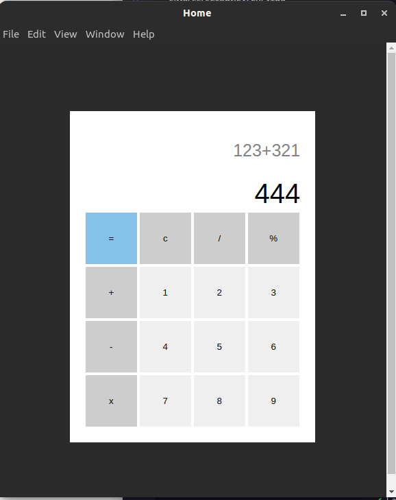

# simpleElectronCalculator


<p align="center">
  <a href="#rocket-technologies">Technologies</a>&nbsp;&nbsp;&nbsp;|&nbsp;&nbsp;&nbsp;
  <a href="#project">Project</a>&nbsp;&nbsp;&nbsp;|&nbsp;&nbsp;&nbsp;
  <a href="#installation">Installation</a>&nbsp;&nbsp;&nbsp;|&nbsp;&nbsp;&nbsp;
</p>

<br>

<p align="center">
  
</p>

## :rocket: Technologies
<input type="hidden" id="rocket-technologies"></input> 
This project was developed with the following technologies:

- [Node.js](https://nodejs.org/en/)
- [Electron](https://www.electronjs.org/)

## 💻 Project
<input type="hidden" id="project"></input> 

This is the first time I tried using Electron. So I made a simple calculator in HTML + CSS to test the power of [Electron](https://www.electronjs.org/). So it's a simple project, but the beginning of a journey of knowledge

## :electric_plug: Run the application

1. Clone the repo
   ```sh
    git clone https://github.com/luanrem/simpleElectronCalculator.git
   ```
2. Enter on the folder
  ```sh
    cd simpleElectronCalculator
   ```
3. Install YARN or NPM packages
   ```sh
   yarn
   // or
   npm install
   ```
4. Run the project
   ```sh
   yarn start
   // or
   npm start
   ```

## :electric_plug: Export the application
<input type="hidden" id="installation"></input> 

Requirement:
 - RPM -> How to install [RPM](https://rpm.org/) 
 - Node LTS version -> [How to install using nvm](https://heynode.com/tutorial/install-nodejs-locally-nvm/)  

   Installing rpm - Ubuntu (if you don't have it)
   ```sh
    sudo apt install rpm
   ```
  Export electron app to application installer
  ```sh
    yarn make
   ```

For more informations about Electron Forge exporting -> [Electron Forge](https://www.electronforge.io) 